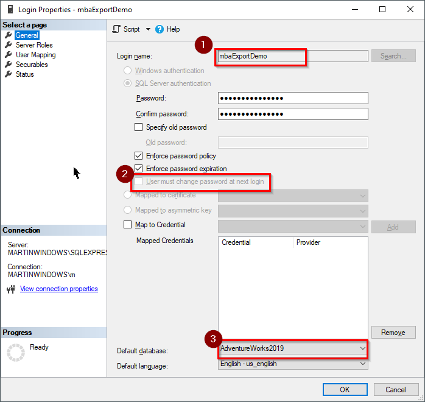
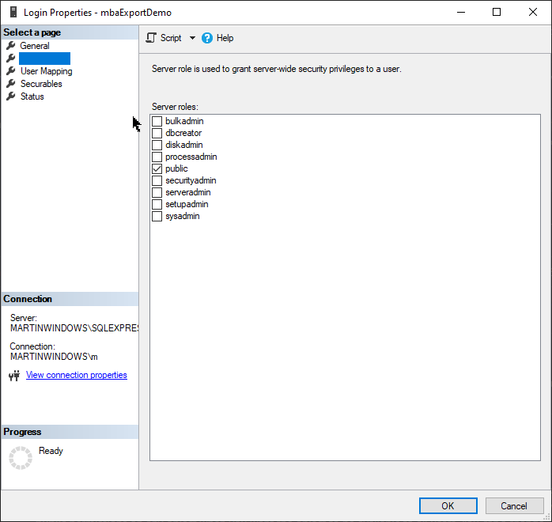
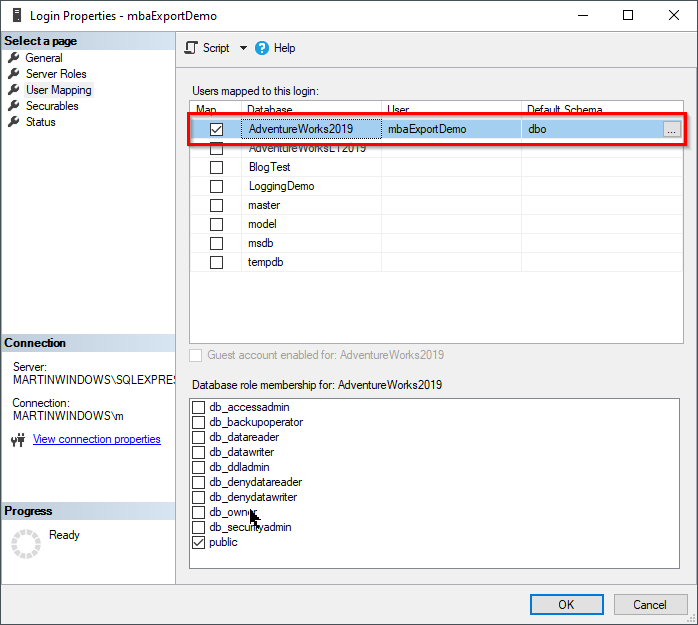
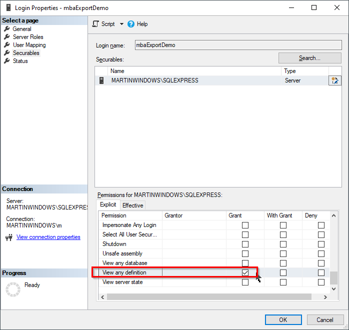

# Export SQL Shcema Definition to SQL script

# See files:
- see the exportet file in "filename.sql"
- see the script in SqlServerShemaBackup.ps1

# BE CAREFULL
- Does also Export the databases users, and there encrypted password !!!

---

## Setup user, to have the minimal required permissions

